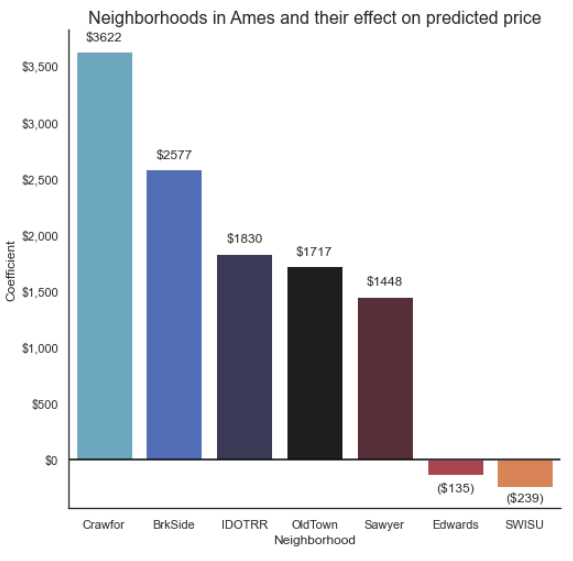

# Project 2 - Ames Housing Data and Kaggle Challenge


## Overview
Create a machine learning model based on the Ames Housing Dataset. This model will predict the sale price of a house when sold.

The Ames Housing Dataset contains over 70 columns of different features relating to houses.

## Problem Statement

The city of Ames is a relatively small town in the state of Iowa, with a population of approximately 66,000.

Ames is also the home of Iowa State University (ISU), a large public university, whose 33,000 students make up half of the town's population. With the university being such an integral part of the society in Ames, would the real estate value be relatively higher in neighborhoods that are closer to the school campus?

Would a new faculty member moving to the area, or any new Ames resident, expect to have to pay a premium to live close to the university?

Null Hypothesis **H<sub>0</sub>**:<br>
Properties located in the neighborhoods have a 5% relative sales price.


Alternative Hypothesis **H<sub>A</sub>**:<br>
Prices in the seven neighborhoods closest to Iowa State do not have a 5% higher price premium.


## Data

Data is provided by Kaggle.

It's data dictionary is found here:
<a href="http://jse.amstat.org/v19n3/decock/DataDocumentation.txt" rel="nofollow">Data description</a>

In order to accurately predict home values near or far from Iowa State, we need to categorize the 28 neighborhoods found in the data.

Neighborhoods will be separated into two groups:
**Near Iowa State**
```
BrkSide	Brookside
Crawfor	Crawford
Edwards
IDOTRR	Iowa DOT and Rail Road
OldTown	Old Town
SWISU	South & West of Iowa State University
Sawyer	Sawyer
```

Not Near Iowa State
```Blueste	Bluestem
Blmngtn	Bloomington Heights
BrDale	Briardale
ClearCr	Clear Creek
CollgCr	College Creek
Greens	Greens
Gilbert	Gilbert
GrnHill	Green Hills
Landmrk	Landmark
MeadowV	Meadow Village
Mitchel	Mitchell - south
Names	North Ames
NoRidge	Northridge
NPkVill	Northpark Villa
NridgHt	Northridge Heights
NWAmes	Northwest Ames
SawyerW	Sawyer West
Somerst	Somerset
StoneBr	Stone Brook
Timber	Timberland
Veenker	Veenker
```

Neighborhood classification was performed manually, using a best guess from:

* Google Maps (maps.google.com)
* www.realtor.com
* https://www.addressreport.com
* https://www.movoto.com
* https://www.trulia.com


Neighborhoods were drawn to approximate areas seen here, with the Iowa State campus in the middle:


### Modeling
A small feature set was included along with all neighborhood data, in order to capture a wider range of inputs.
These were chosen somewhat arbitrarily:
* Overall Qual
* Year Built
* 1st Flr SF
* 2nd Flr SF
* Garage Cars
* bathrooms (a new feature created to combine four separate bathroom items)
* Lot Shape
* near_ISU (a new categorical feature showing whether a house is in one of the six neighborhoods
close to the Iowa State campus)

Models performed:
* Linear Regression
* Lasso Regression
* Ridge Regression

### Conclusions

The near_ISU feature had a positive correlation on the predicted home prices in the Ames, IA dataset, shown here
to be $3,122.  In other words, we expect to see an $3,122 rise in price for all homes in the seven
surrounding neighborhoods, holding all other items constant.


To determine if this is above a 5% threshold, we calculate the mean price of all homes in the training set.

The average price of all houses in the data set is: $180,995.11.<br>
5 percent of the average is $9,049.76.

Since $3,122 is less than 5%, we reject the null hypothesis **H<sub>0</sub>**.

The seven close neighborhoods each had their own coefficient value, which showed different behavior within
the neighborhoods.

For example, Crawford had the highest impact, being over $3600, while the worst performing was the
South and West of Iowa State, with -$239.


